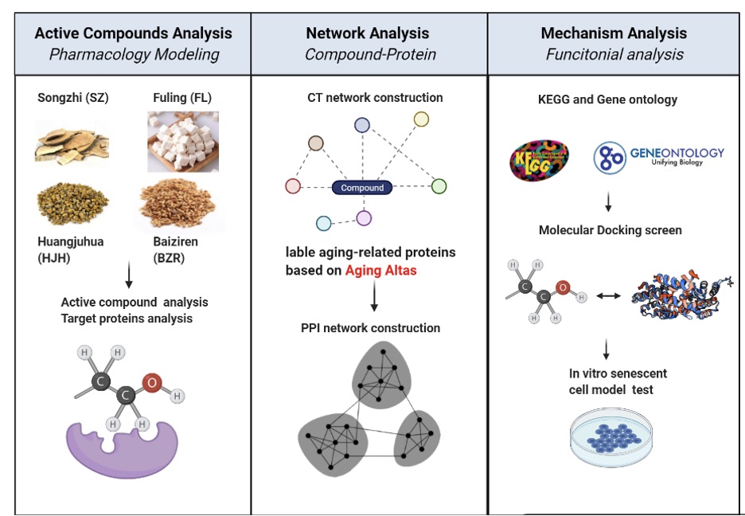

# A Network Pharmacology-Based Study of the Anti-aging Properties of Traditional Chinese Medicine Sisheng Bulao Elixir

This repository contains the scripts to reproduce the result of the manuscript [*A Network Pharmacology-Based Study of the Anti-aging Properties of Traditional Chinese Medicine Sisheng Bulao Elixir*]( )

## Abstract

**OBJECTIVE**： To decipher the anti-aging targets and molecular mechanism of Sisheng Bulao Elixir (SBE) by constructing a systematic method based on a novel aging database.

**METHODS:** The putative bioactive compounds and their target proteins of SBE were screened out from Traditional Chinese Medicine System Pharmacology (TCMSP). Then the target proteins related to aging were identified via matching with the Aging Alta database. Meanwhile, the active compounds with their target aging proteins were analyzed by compound-target (CT) protein network. Next, the core target proteins were screened out using protein-protein interaction (PPI) network. Afterwards, molecular docking was performed to analyze the binding activities of the core compounds with their targeting aging-related proteins. Finally, the antioxidant activity of SBE was confirmed by *in vitro* senescent cells model.

**RESULTS:** 41 active compounds were obtained from 639 compounds in SBE, 61 target proteins related to aging were identified via matching with the Aging Alta, and 57 out of 61 proteins were targeted by flavonoids. Then 11 flavonoids, which were most bioactive in targeting aging, were acquired by CT protein network. And AKT1, MAPK3, TP53, VEGFA, IL6, HSP90AA1, *etc*. were screened out as core aging-related proteins targeting SBE by PPI network analysis. Furthermore, three flavonoids (quercetin, kaempferol, and luteolin) targeting to more than 100 aging-related proteins were molecularly docked with their shared three target proteins (AKT1, HSP90AA1, and IL6) to analyze their binding activities. Finally, the antioxidant activity of SBE was confirmed by *in vitro* senescent cells model.

**CONCLUSIONS:** Our study constructed a novel and efficient analysis method for studying the anti-aging properties of TCM, which provides substantial evidence to understand the molecular mechanism in anti-aging of SBE.

## Content

- `/data/`: the raw data to reproduce the figures
- `/result/`: the result of herb.ipynb
- `/docs/`: the compound-target network of SiSheng Bulao Elixir
- `herb.ipynb`: the raw code to reproduce the figures

## Contact

- Zehua Zeng (starlitnightly@163.com)
